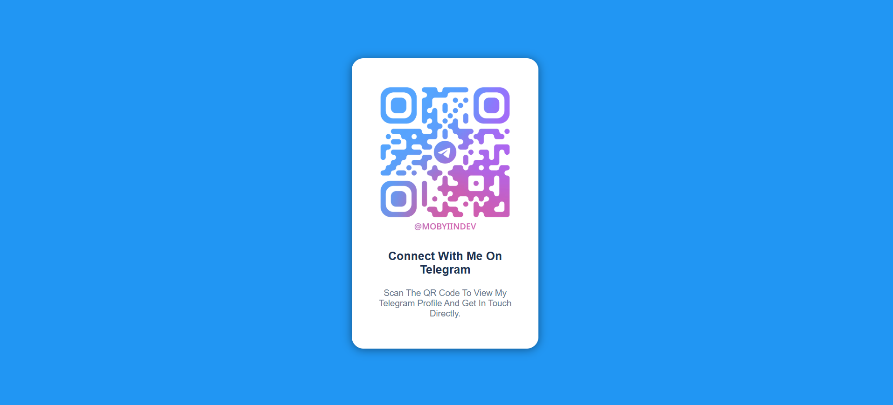

# QR Code Component 🔳

This is a simple **QR Code Component** challenge built with HTML and CSS.

## 📷 Preview
<table>
  <tr>
    <th>🖥️ Desktop View</th>
    <th>📱 Mobile View</th>
  </tr>
  <tr>
    <td></td>
    <td></td>
  </tr>
</table>

## 🚀 Live URL

👉 [Live Site Url](https://Mobyiin.github.io/Qr-Code-Component)

## 🛠️ Built with

- HTML5
- CSS3 (Flexbox)

## 🎯 What I learned

While building this, I learned how to:

- Structure a component with clean HTML
- Center items using Flexbox

## 🧑‍💻 Author

[GitHub](https://github.com/Mobyiin)

## 📚 Source

This challenge is from [Frontend Mentor](https://www.frontendmentor.io/challenges/qr-code-component-iux_sIO_H)  
